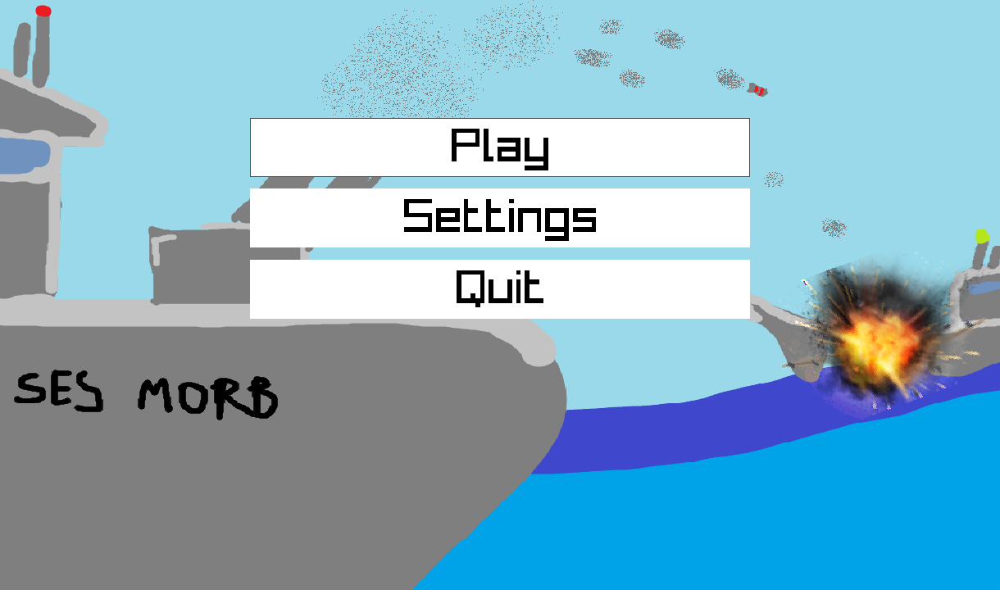
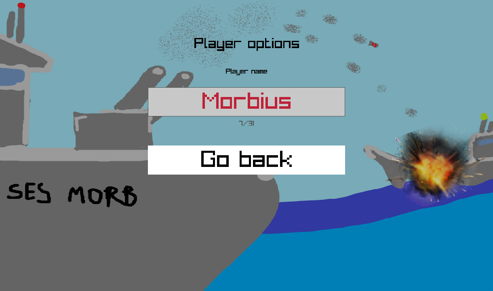
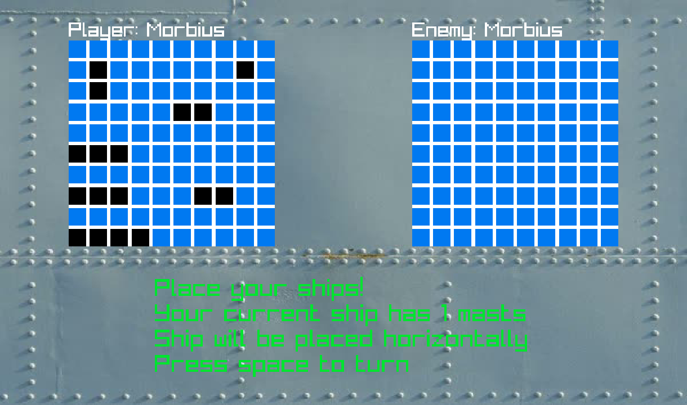
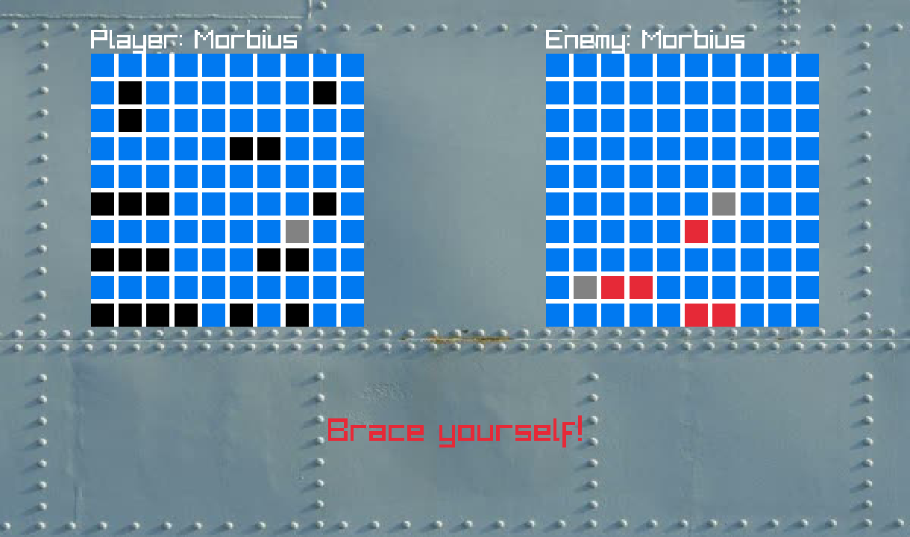
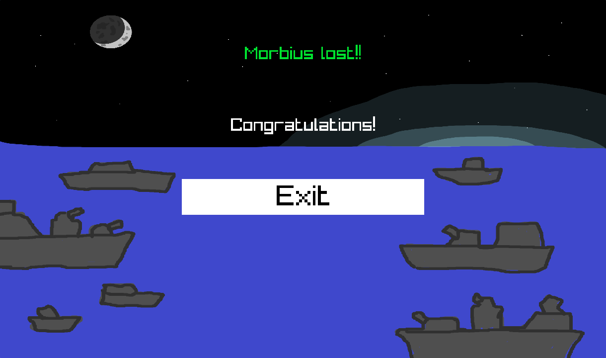

<!--toc:start-->
- [Classic game of battleships online.](#classic-game-of-battleships-online)
  - [Screenshots](#screenshots)
  - [Game preparation](#game-preparation)
  - [Starting the game](#starting-the-game)
  - [Rules](#rules)
- [Dependencies](#dependencies)
- [Installation](#installation)
  - [Manual compilation](#manual-compilation)
  - [NixOS](#nixos)
  - [Arch Linux](#arch-linux)
  - [Release](#release)
- [Uninstall](#uninstall)
  - [Manual](#manual)
    - [Windows:](#windows)
    - [Linux](#linux)
  - [NixOS](#nixos-1)
  - [Arch Linux](#arch-linux-1)
- [Information](#information)
- [Roadmap:](#roadmap)
- [Special thanks](#special-thanks)
- [AI use](#ai-use)
<!--toc:end-->

This is a rewrite of [this project](https://github.com/szymon-jozef/battleship-pygame-lan), but in cpp.

# Classic game of battleships online.

Currently WIP.

## Screenshots






## Game preparation
To play one of these conditions must be met:
- Both players are on the same local network
- One player [has forwarded a port on their router](https://en.wikipedia.org/wiki/Port_forwarding) and shared their [public IP](https://www.whatismyip.com/) with the other player.

* game runs on TCP/6767

## Starting the game
*Before starting the game you could set your name in the settings, but that's optional – game will run fine, if both of you have the same name*

One player needs to host the game:
- Click: `Play -> Host Game` and share your IP with the other player

The other player needs to join:
- Click: `Join Game -> <enter the IP address the other player gave you> -> Join`


## Rules
Every player has:
- 1 ship with 4 masts
- 2 ships with 3 masts
- 3 ships with 2 masts
- 4 ships with 1 mast

They place them on 10x10 grid either vertically or horizontally. Ships can't share a nearby field.

After both players place all their ships the war begins. The player whose turn it is can shoot at any field they like. If they miss, they lose their turn, but if their shot lands a hit, they can shoot another time.

The player who shoots all the ships of his enemy first wins.

# Dependencies
- [boost](https://www.boost.org/)
- [spdlog](https://github.com/gabime/spdlog)
- [raylib](https://www.raylib.com/)
- [glfw3](https://www.glfw.org/)
- [catch2 (for tests)](https://github.com/catchorg/Catch2)

# Installation
## Manual compilation
Install all the dependencies or use vcpkg.

1. Create build directory:

*if you have dependencies installed*
```bash
cmake -B build -G Ninja -DCMAKE_BUILD_TYPE=Release
```

*if you want to use vcpkg*
Linux/macOS(probably?)

```bash
cmake -B build -G Ninja -DCMAKE_TOOLCHAIN_FILE="$VCPKG_INSTALLATION_ROOT/scripts/buildsystems/vcpkg.cmake" -DCMAKE_BUILD_TYPE=Release
```

Windows:

```bash
cmake -D"CMAKE_TOOLCHAIN_FILE=$env:VCPKG_INSTALLATION_ROOT/scripts/buildsystems/vcpkg.cmake" -B build 
```

2. Compile:
```bash
cmake --build build
```

3. (Optionally) install:
```bash
cmake --install build --strip
```

4. Run:
```bash
build/battleships[.exe if on windows]
```
Make sure you're in the project root when you do that!


## NixOS
This repo provides a flake, which exposes a package and a module. The module opens port 6767 in the firewall and creates a .desktop entry.

To use it add:
```nix
battleships.url = "github:szymon-jozef/battleships";
```
to your `flake.nix` inputs. Then somewhere in your configuration:
```nix
imports = [
    inputs.battleships.nixosModules.default
];

programs.battleships.enable = true;
```

## Arch Linux
There is a `PKGBUILD` in the repo. Just clone it and run:
```bash
makepkg -si
```

## Release
You can also install a prebuilt binary from the [release tab](https://github.com/szymon-jozef/battleships/releases).

# Uninstall
## Manual
Remove files that were installed by cmake. That includes:
- assets
- binary

### Windows:
- `C:\Program Files (x86)\battleships`

### Linux
- `/usr/bin/battleships`
- `/usr/share/battleships`

## NixOS
Just remove lines you added from your configuration.

## Arch Linux
`sudo pacman -Rns battleships battleships-debug`

# Information
If you have any suggestion or want to help improve the game, please refer to [contributing guide](CONTRIBUTING.md)

# Roadmap:
- Fixing what's not working
- [ ] Single player
- [ ] Highlighting hovered elements

# Special thanks
- My friend [real-morbius](https://github.com/Real-Morbius) for making the game assets
- My friend [jaek187](https://github.com/jaek187) for helping with w*ndows shenanigans and some code optimizations
- Youtuber [javidx9](https://www.youtube.com/@javidx9) for [his series on boost::asio](https://www.youtube.com/watch?v=2hNdkYInj4g)

# AI use
During development of this project AI was used only to code review. It's a hobby/educational project, so it was not vibe coded.
